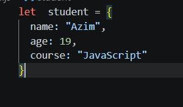

# Object в JavaScript

* Object в JavaScript — это тип данных, который хранит информацию в виде ключ : значение.

* Объект нужен, чтобы хранить несколько связанных данных в одном месте.

* Например, информация о студенте:

